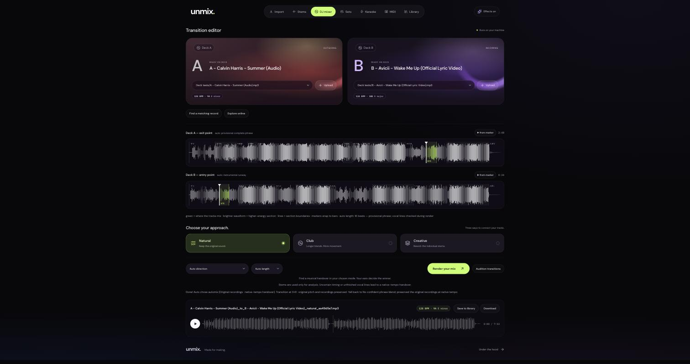
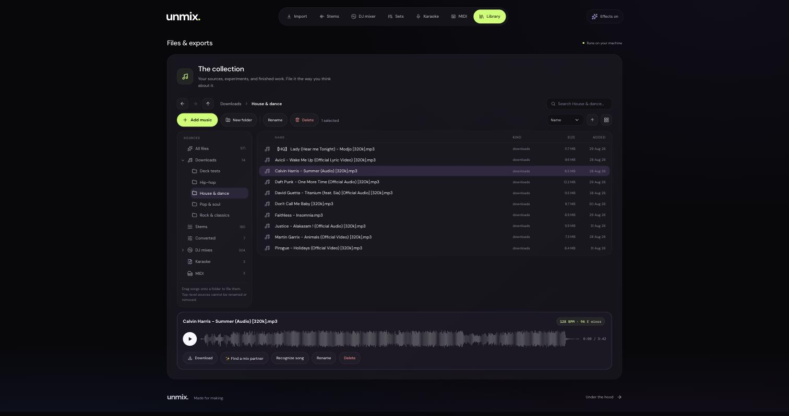
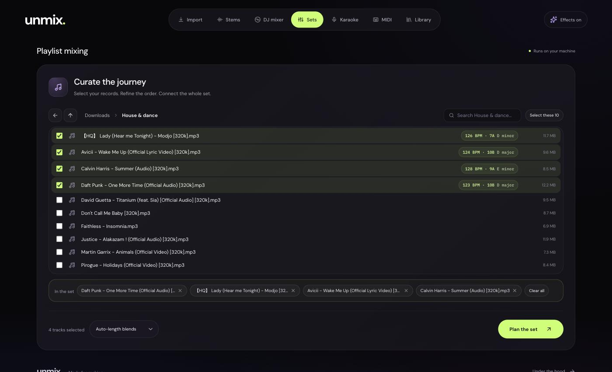
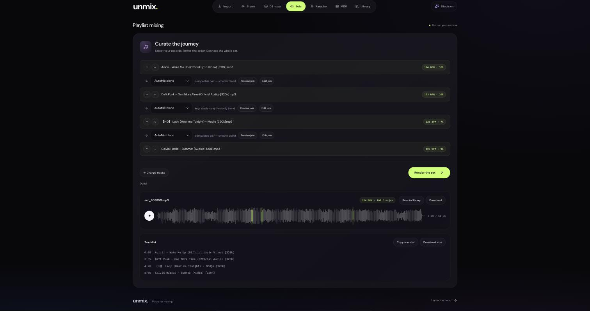
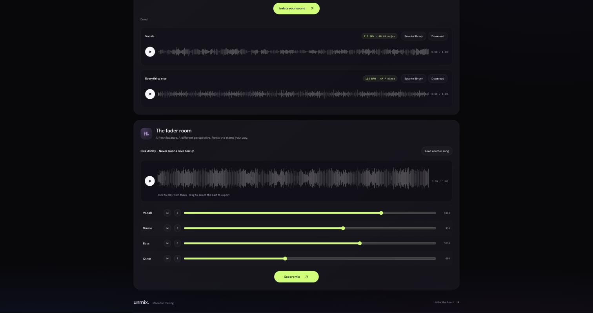
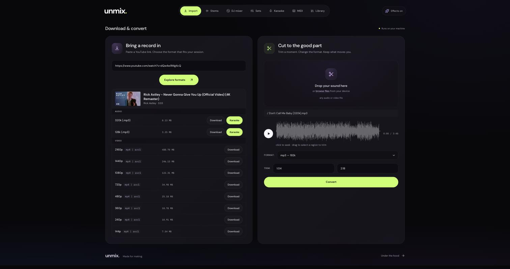
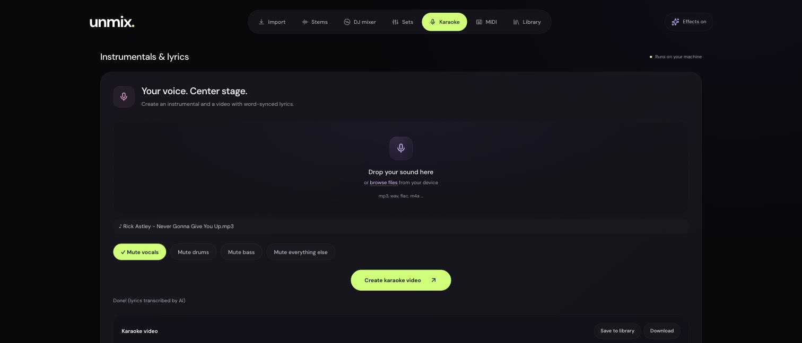
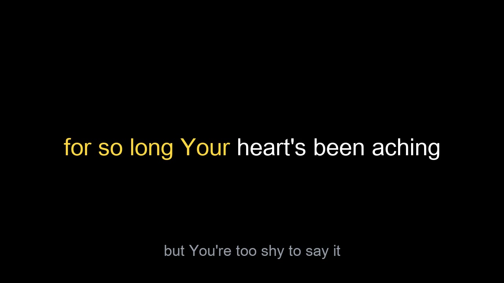
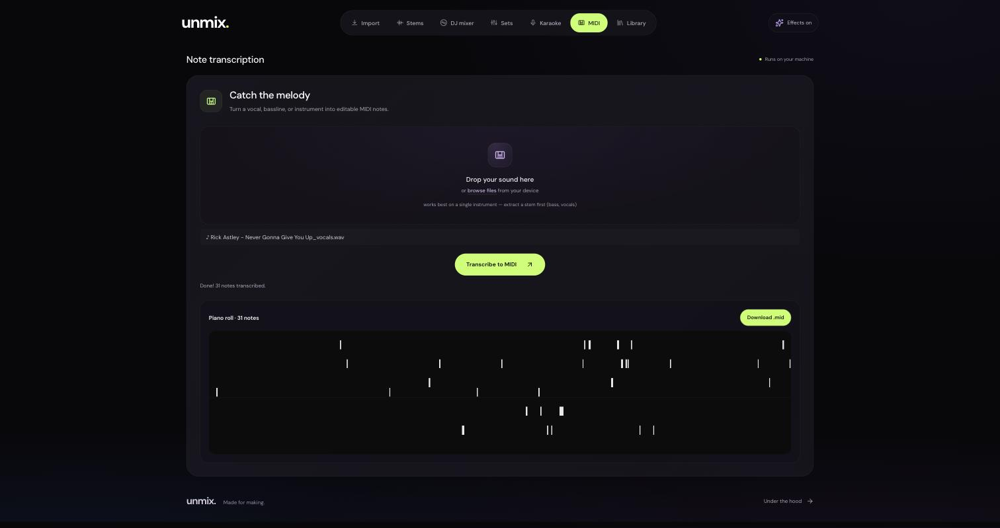

<h1 align="center">unmix.</h1>

<p align="center"><sub>THE LOCAL AUDIO WORKSPACE</sub></p>

<p align="center">
  <strong>Your music. Taken apart. Put together differently.</strong><br />
  A local audio workspace for mixing tracks, isolating stems, building sets, and making karaoke.
</p>

<p align="center">
  <a href="#get-started">Get started</a> ·
  <a href="#the-workspace">The workspace</a> ·
  <a href="docs/mixing.md">Inside the mixer</a> ·
  <a href="#development">Development</a>
</p>

---

## Less setup. More sound.

Load a track, pull out its vocals, find its next match, or turn a few records into
a continuous set. UnMix brings the useful parts of an audio toolkit into one
browser workspace. Processing happens on your machine, with no UnMix account or
hosted rendering service.

Two glowing decks. Readable waveforms. Direct controls. A dark violet/lime
interface that puts the tools first, with responsive layouts, keyboard-accessible
controls, and a reduced-motion option.

## The workspace

| Tool | What you can do |
| :--- | :--- |
| **Import** | Download from a YouTube link, choose audio/video quality, or convert and trim local files. |
| **Stems** | Isolate vocals, drums, bass, and other instruments with Demucs. Choose the six-stem model for guitar and piano, then rebalance the stems. |
| **DJ mixer** | Load two decks, inspect phrase and energy waveforms, adjust handover markers, and audition alternative transitions before exporting. |
| **Sets** | Pick records through the same folder browser as the Library, with search across every folder, then arrange the playlist and render a continuous mix with per-transition controls. |
| **Karaoke** | Remove selected instruments and render an MP4 with synchronized, word-highlighted lyrics. |
| **MIDI** | Turn a single-note melody or bass line into editable MIDI. Best with an isolated stem, not a full arrangement. |
| **Library** | A file browser for everything the app makes and holds: folders you create, rename, nest, and drag songs into, plus search, sorting, previews, and a track sent straight to the DJ mixer. |

## A look around

Every shot below is the real interface on a working library — no mockups.

### DJ mixer

Two decks with measured BPM and key, phrase and energy waveforms with editable
handover markers, three mixing directions, and the rendered mix underneath.



### Library

Sources down the side, real folders in the middle. Drag songs onto a folder to
file them, rename in place, search from wherever you are.



### Sets

Pick the records from the same folder browser the Library uses — walk the
folders, or search across all of them; ticks survive both, and what you have
chosen so far stays listed underneath.



Then let the planner order them, adjust each join, and render one continuous
mix with a timestamped tracklist.



### Stems

Separate a track into its parts, then rebalance them on faders and export the
result.



### Import

Paste a link and pick a format, or trim and convert a file you already have.



### Karaoke

Choose what to mute, and the renderer writes an MP4 with word-synced lyrics.



A frame from the MP4 it produced — sung words in amber, the current line in
white, the next line waiting below:



### MIDI

Transcribe an isolated stem into notes and download the `.mid`.



## A mixer with three directions

**Natural** keeps the original recordings and looks for a restrained, phrase-aware
handover. **Club** explores longer blends and more flexible instrumental entries.
**Creative** opens up stem-based transition methods for more transformative mixes.

The planner considers local rhythm, energy, bass, harmony, and vocal activity—not
just two BPM numbers. Timing and level checks can reject a bad overlap; when a
confident blend is unavailable, Natural and Club use a short native-tempo handover.

Start with **Natural → Auto direction → Auto length**. Load both decks, choose
**Audition transitions**, listen, then export your preferred version. Manual cue
markers and effects are there when you want to take over.

> Music is not a solved matching problem. Vocal detection, phrasing, and separation
> are estimates; some track pairs will still sound wrong. UnMix offers candidates
> and controls, not a promise of professional-DJ quality. Your ears make the call.

Read the [mixing guide](docs/mixing.md) for timing safeguards, exact audition
exports, local preference learning, and blind listening comparisons.

## Get started

### macOS

You need Git, Python 3, and FFmpeg. The built frontend is included, so Node.js is
only needed when editing the interface.

```bash
git clone https://github.com/DanilAntyp/UnMix.git
cd UnMix

brew install ffmpeg
python3 -m venv .venv
.venv/bin/python -m pip install -r requirements.txt
.venv/bin/python app.py
```

Open **http://localhost:5555**. The app also attempts to open it automatically.

- **First run:** Demucs and Whisper download their model weights when first used.
  Allow extra time and disk space; no music or model weights are bundled here.
- **Hardware:** Demucs uses Apple Silicon's MPS backend or CUDA when available,
  with CPU fallback. Processing long tracks can take several minutes.
- **Optional tools:** `brew install rubberband chromaprint` enables the external
  time-stretch tool and audio fingerprinting. Recognition can use your own
  AcoustID application key in the ignored `acoustid_key.txt` file.
- **Optional analysis:** the allin1 neural phrase model is not installed or
  downloaded automatically. The mixer falls back to spectral section analysis.
- **Other platforms:** the core uses Python and FFmpeg, but macOS is the documented
  setup. Karaoke currently references a macOS font path in `karaoke.py`; adjust it
  before using that renderer elsewhere.

Keep the server on localhost. It is a personal desktop tool, not an authenticated
multi-user service intended for public internet exposure.

## Local processing, clear boundaries

Separation, rendering, and transcription run locally. This does **not** mean the
entire app is offline: downloads, model acquisition, lyric lookup, music metadata,
audio recognition, online suggestions, and web fonts can contact external services.
Recognition sends an audio fingerprint; metadata/lyric searches can send track
information. Existing local audio can be processed without those online features
once the required models are available.

Your library and generated files stay out of source control:

```text
downloads/       Source audio and video
separated/      Extracted stems
djmixes/        Mixes, auditions, and saved candidates
karaoke/        Lyric videos
converted/      Converted and trimmed exports
midi/           Transcribed notes
```

Folders you make in the Library are real subdirectories of these, so the filing you
do in the app is the filing you see in Finder. The six top-level directories
themselves are fixed: the app writes into them, so they cannot be renamed or removed
from the Library.

Analysis caches, listening ratings, learned preferences, local credentials, model
weights, and audio/video/MIDI files are ignored by Git too. The built frontend
is intentionally included. Supply your own media and only
download, process, or share material you have permission to use.

## Development

The stack is **React + Vite** in front, **Flask + Python** behind it, with
**FFmpeg**, **Demucs**, and **faster-whisper** handling audio and transcription.

Run the Python server as above, then in another terminal:

```bash
cd frontend
npm ci
npx vite
```

Vite proxies application requests to the local Flask server. To rebuild the UI
served by Flask, run this from the repository root:

```bash
cd frontend
npx vite build
```

Commit the updated `frontend/dist/` together with its source changes. That keeps
the clone-and-run path available without a Node.js build step.

### Checks

From the repository root, with FFmpeg installed:

```bash
.venv/bin/python -m unittest test_dj_transitions test_mixengine test_naturalmix -v
```

These tests cover audio-engine regressions and safeguards. They are not a
listening-quality benchmark. For ear-based comparisons, see the
[blind listening workflow](docs/mixing.md).

### Command-line stem extraction

```bash
.venv/bin/python extract_vocals.py path/to/song.mp3 --out separated/
```

Add `--mp3` for MP3 output, or `--model htdemucs_ft` for the slower fine-tuned
model. Multiple input files are supported.

## Built on good work

UnMix uses [Demucs](https://github.com/adefossez/demucs),
[faster-whisper](https://github.com/SYSTRAN/faster-whisper),
[FFmpeg](https://ffmpeg.org), [yt-dlp](https://github.com/yt-dlp/yt-dlp),
[React](https://react.dev), [Vite](https://vite.dev), and
[Lucide](https://lucide.dev). Lyrics can come from [LRCLIB](https://lrclib.net),
and optional neural structure analysis uses
[all-in-one](https://github.com/mir-aidj/all-in-one).

Found an awkward transition or a broken workflow? [Open an issue](https://github.com/DanilAntyp/UnMix/issues)
with your platform, steps to reproduce, mixing mode, and what you heard. Do not
attach copyrighted recordings, private library dumps, or credentials.

---

<p align="center"><strong>unmix.</strong><br /><sub>Made for making.</sub></p>
